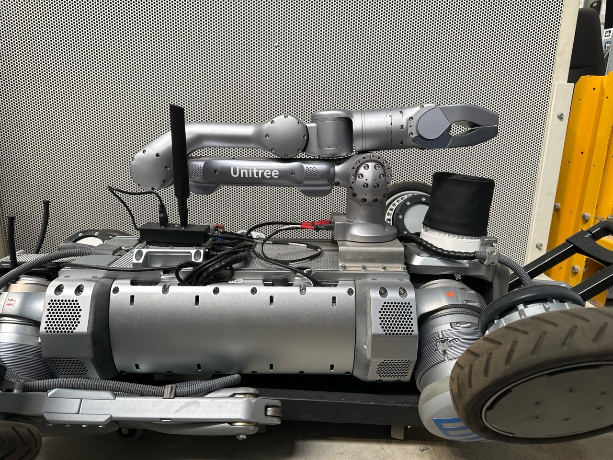

# B2-W + Z1 Isaac Lab asset

This directory contains a separate wheeled B2-W + Z1 model. It does not
replace or modify the existing footed `assets/b2_z1` model.

## Geometry and joints

- The B2-W base, leg, and wheel descriptions come from Unitree's official
  `unitree_ros` repository at commit
  `7d6075f7f58588b189b940130e3edab3c839b2df`.
- The Z1 links and gripper also come from that repository.
- The four official wheel links and continuous joints are retained, but are
  renamed from Unitree's `*_foot` convention to `*_wheel` for clarity.
- The generated model preserves the official geometry and dynamics. The only
  structural additions are the photo-matched mount/adapter and a massless,
  geometry-free nominal `tcp_frame` for controller development.
- The B2-W body collision box has its upper surface at `z = 0.075 m` in the
  `base_link` frame. The adapter occupies `z = 0.075...0.110 m`, so the Z1
  mounting plane is exactly `0.035 m` above that surface.
- The provisional mount position is `(x, y, z) = (0.211, 0.0, 0.110) m` in
  `base_link`. Only the 35 mm vertical offset is hardware-measured. The XY
  placement and the simplified `130 x 120 mm` adapter footprint should be
  updated after measuring the real adapter or obtaining its CAD.

The tracked installation reference is
[`reference/user_b2w_z1_mount_side.jpg`](reference/user_b2w_z1_mount_side.jpg),
SHA-256
`8c50c2e766b5bf78c983dc1bf93f3e48333c24979b8a667c3b78aa0d537ab2ba`.
In Unitree's B2-W frame, `+x` points toward the lidar/front, `+y` points left,
and `+z` points up. The photograph therefore supports a forward-half,
laterally centered, upright Z1 with `rpy = (0, 0, 0)`. A rough side-view scale
check places the mount around `x = 0.20...0.23 m`, consistent with the selected
`0.211 m`, but this is not a metric calibration. The side view cannot establish
a millimetre-scale lateral offset or independently separate mount yaw from the
Z1 `joint1` encoder zero.

The generator exposes `--mount-x`, `--mount-y`, `--mount-roll`,
`--mount-pitch`, and `--mount-yaw`. Mount Z is intentionally derived as
`--deck-z + --adapter-height`, keeping the measured spacer height separate
from the chosen deck datum. Update these values only from CAD or an explicit
base-to-Z1 measurement, not by trying to extract millimetres from this image.



The adapter is currently a base-attached visual and collision box. Its mass is
not added to the base inertia because the real adapter mass and center of mass
are not yet known. It is only a conservative placeholder: the photograph shows
a flanged/channel-like bracket rather than a solid box, and the official body
mesh has raised rails above the central `z = 0.075 m` datum. Replace this proxy
before enabling full arm/body self-collision or studying contact loads.

The model contains a nominal fixed `tcp_frame` at
`gripper_stator -> tcp_frame = (0.145, 0, 0) m`, with identity rotation. Together
with the official `link6 -> gripper_stator = (0.051, 0, 0) m`, this makes the
nominal `link6 -> tcp_frame` offset `0.196 m`. It is suitable for consistent
simulation-only pose tracking and lies near the center of the official gripper
tips. It is **not** a measured real-robot TCP: measure the actual grasp center
and regenerate with `--tcp-x/y/z` and `--tcp-roll/pitch/yaw` before sim-to-real.

The generator uses the following explicit naming map while preserving the
official source values:

- Z1 `link00...link06` -> project `link0...link6`;
- Z1 `gripperStator` / `jointGripper` -> project `gripper_stator` /
  `gripper_joint`;
- B2-W `*_foot` / `*_foot_joint` -> project `*_wheel` /
  `*_wheel_joint`.

## Runtime configuration

`b2w_z1_articulation_cfg.py` exposes four configurations. `B2W_Z1_CFG` uses the
photo-matched provisional stacked Z-fold
`[0.0, 0.15, -0.45, 0.30, 0.0, 0.0] rad` for
joints 1--6. This keeps the returning arm and gripper above the lidar. The pose
was reconstructed from a side photograph and is provisional; replace it with
encoder readback from the real robot when available. The arm's all-zero pose is
not a safe stow for this assembled model because it intersects the lidar region
and places joints 2 and 3 at their limits.

`B2W_Z1_TRAINING_CFG` instead resets the arm to the raised, forward-facing
ready pose `[0.0, 1.35, -1.65, 0.30, 0.0, 0.0] rad`. TCP-training tasks should
use this variant so the arm starts deployed and away from joint limits. Both
configurations have independent actuator groups for the 12 leg joints, four
continuous wheel joints, six Z1 joints, and the gripper. The PD gains,
armature, joint friction, and command delay are safe starting values inherited
from the existing project and WheelRL model; they are not identified B2-W + Z1
hardware parameters. In particular, the wheel velocity-error gain of
`10 N m/(rad/s)` is a nominal simulation value that passed straight/reverse
execution tests while preserving the official 20 N m effort limit. It has not
been measured on the real robot. Calibrate and/or randomize these parameters
before sim-to-real deployment.

`B2W_Z1_ROBOT_LAB_POLICY_CFG` is a third, task-specific compatibility preset
for the pinned public `robot_lab` B2-W locomotion checkpoint. It reproduces the
checkpoint's nominal leg pose and its hip/thigh/calf/wheel actuator parameters,
while retaining this combined asset's Z1 and gripper actuators. It is kept
separate because changing the actuator model underneath a learned policy is
not a neutral tuning change. Use the explicit name-mapped adapter in
`controllers/robot_lab_b2w_policy.py`; the combined articulation's global
joint order must never be assumed to equal the checkpoint's 16-joint order.

`B2W_Z1_ROBOT_LAB_TCP_CFG` is the fourth, trainable-task preset. It retains the
frozen policy's exact leg/wheel contract, switches Z1 from photo stow to the
raised ready pose, resets the root at the measured 0.615 m flat-ground
equilibrium, and disables the inherited arm/gripper command delay for the
nominal DIK gate. Delay must be reintroduced later from measured hardware data;
this nominal preset is not a sim-to-real calibration claim.

For direct use in Isaac Sim, open `b2w_z1_stow.usda`. It is a lightweight USD
wrapper around the generated `b2w_z1.usd` and authors the same stow joint state
in degrees. Keeping the preset in a wrapper means regenerating the base USD
does not erase it.

Do not reuse the current footed B2 task unchanged. A B2-W task needs explicit
wheel velocity actions and should replace foot-air-time/foot-slide rewards with
wheel contact, rolling, slip, and wheel-speed terms.

## Regeneration

Clone the official source and check out the pinned revision:

```bash
git clone https://github.com/unitreerobotics/unitree_ros.git /tmp/unitree_ros_b2w
git -C /tmp/unitree_ros_b2w checkout 7d6075f7f58588b189b940130e3edab3c839b2df
```

Generate the reviewable URDF and a temporary URDF with absolute mesh paths:

```bash
python source/LeggedManip_Lab/LeggedManip_Lab/assets/b2w_z1/build_combined_urdf.py \
  --unitree-ros-root /tmp/unitree_ros_b2w \
  --output source/LeggedManip_Lab/LeggedManip_Lab/assets/b2w_z1/source/b2w_z1.urdf

python source/LeggedManip_Lab/LeggedManip_Lab/assets/b2w_z1/build_combined_urdf.py \
  --unitree-ros-root /tmp/unitree_ros_b2w \
  --output /tmp/b2w_z1_resolved.urdf \
  --resolve-mesh-paths
```

Convert with the Isaac Lab environment:

```bash
ACCEPT_EULA=Y /home/mingqian/miniforge3/envs/env_isaaclab51/bin/python \
  /home/mingqian/IsaacLab/scripts/tools/convert_urdf.py \
  /tmp/b2w_z1_resolved.urdf \
  source/LeggedManip_Lab/LeggedManip_Lab/assets/b2w_z1/b2w_z1.usd \
  --joint-target-type none --headless --device cpu
```

Run the structural and physics smoke test:

```bash
ACCEPT_EULA=Y /home/mingqian/miniforge3/envs/env_isaaclab51/bin/python \
  source/LeggedManip_Lab/LeggedManip_Lab/assets/b2w_z1/validate_b2w_z1.py \
  --headless --device cpu
```

The upstream Unitree license is preserved at `source/LICENSE.unitree_ros`.

## Validation gates

Do not infer production whole-body-control readiness from the asset smoke test
alone. The validation sequence and current status are recorded in:

- [fixed-base TCP DIK gate](../../../../../docs/B2W_Z1_TCP_DIK_GATE_ZH.md): passed;
- [standalone world-frame TCP harness](../../../../../docs/B2W_Z1_WORLD_FRAME_GATE_ZH.md):
  passed, but it prescribes root motion and is not a wheel/contact WBC;
- [wheel execution gate](../../../../../docs/B2W_Z1_WHEEL_GATE_ZH.md):
  straight/reverse subset passed, complete gate failed at turning.
- [frozen `robot_lab` B2-W policy gate](../../../../../docs/B2W_Z1_ROBOT_LAB_FOUNDATION_ZH.md):
  the combined B2-W + Z1 model stands, translates and turns in both directions;
  low-speed yaw asymmetry and stopping/contact margins remain measurable.
- [physical frozen-locomotion plus world-TCP gate](../../../../../docs/B2W_Z1_ROBOT_LAB_TCP_HOLD_GATE_ZH.md):
  passed at 1, 16 and 64 environments without prescribing root state.
- [trainable TCP task MVP](../../../../../docs/B2W_Z1_TCP_TASK_MVP_ZH.md):
  registered task, 1/16/64-environment smoke tests, RSL-RL checkpoint/export
  integration and the explicitly non-converged 20-iteration pilot.

The mount, adapter mass/inertia, loaded wheel radius, tire/contact behavior,
motor-loop parameters, gripper geometry and TCP remain provisional until they
are measured on the real B2-W + Z1 assembly.
